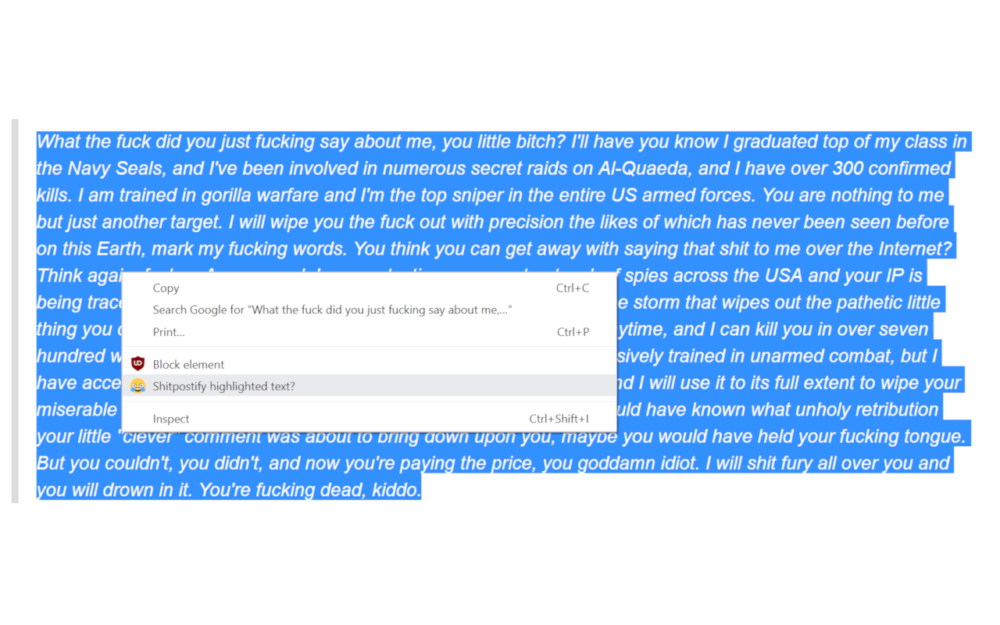
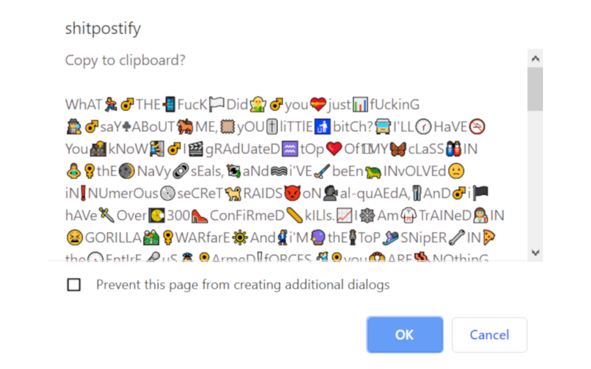

# SHITPOSTIFY

Needed a way to quickly mock someone's comment online, with minimal effort? Thankfully, **shitpostify** fills that gap for you!

All you need to do is install the extension, right click on a highlighted block of text, then click `Shitpostify highlighted text?` to see that Internet Tough Guy's comment ridiculed.

---

## Installation:

This is published on the [Chrome Web Store](https://chrome.google.com/webstore/detail/shitpostify/dojihbiflikelfjnoaljoeiklhgdnijp), but if you would like to compile it from source, follow the below instructions.

- Download the source code by going to the `"Clone or Download"` button, and click `"Download ZIP"`.
- Extract the files
- Go to [chrome://extensions](chrome://extensions) and make sure `"developer mode"` is enabled (top right corner)
- Select `"Load unpacked"` (top left corner) and upload the unzipped folder.

You're done!

---

## Demo media: 
(looks like Loom recordings do not capture the right click menu or the popup box with the text, but you get the gist. I'll use a better screen recording later)

